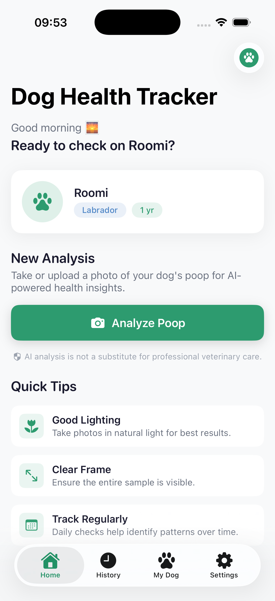
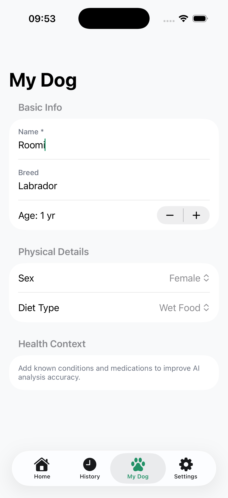
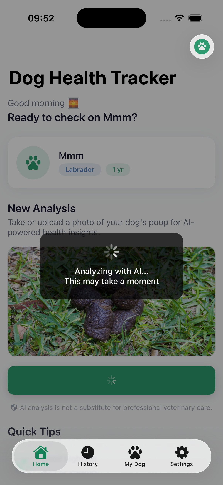
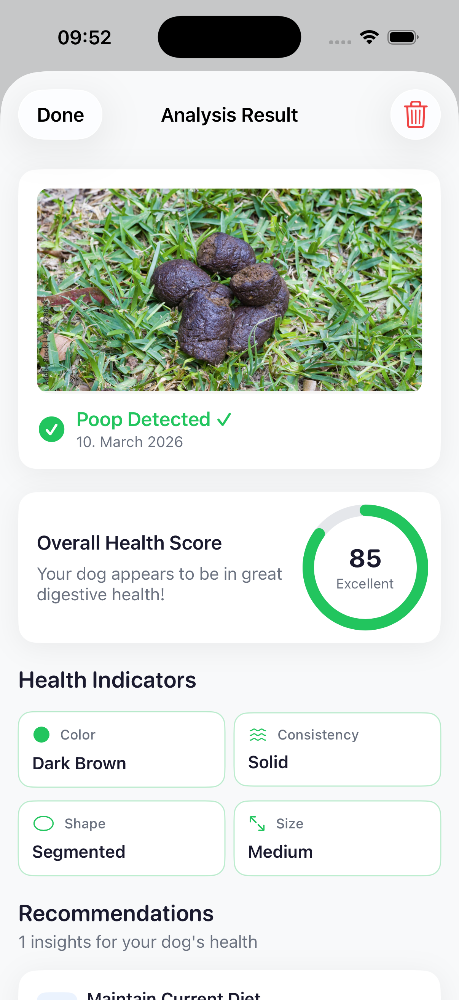
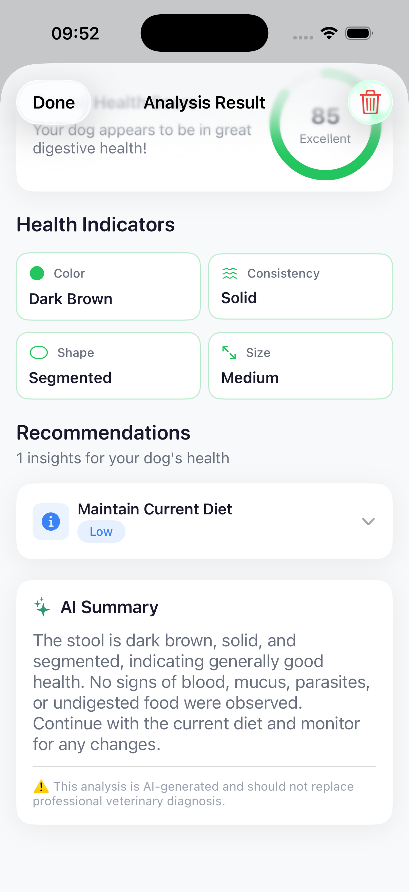
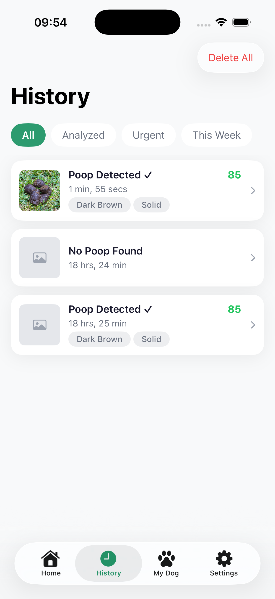
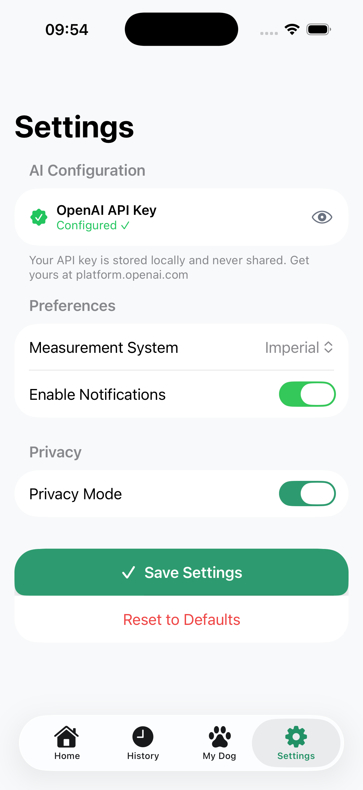

# 🐾 PawCheck — Dog Health Tracker


> An AI-powered iOS app that analyzes your dog's poop photos to provide actionable digestive health insights — built to demonstrate production-grade iOS architecture with real-world AI integration.

---

## 📸 Screenshots

| Home | Profile |Processing | Analysis Result | Health Score | History | Settings |
|------|---------|-----------|-----------------|--------------|---------|----------|
|  |  |  |  |  |  |  |
---

## ✨ Features

- 📷 **Camera & Photo Library** — Capture or select poop images for analysis
- 🤖 **AI Health Analysis** — GPT-4o Vision detects poop presence and evaluates health indicators
- 🎯 **Health Score** — 0–100 composite score with tier rating (Excellent → Critical)
- 🔬 **Detailed Indicators** — Color, consistency, shape, size, blood, mucus, parasite detection
- 💡 **Smart Recommendations** — Prioritized, actionable health advice with vet referral alerts
- 🐕 **Dog Profile** — Personalizes AI analysis with breed, age, diet, and medical history
- 📋 **Analysis History** — Paginated history with filtering and swipe-to-delete
- ⚙️ **Settings** — API key management, measurement system, notification preferences

---

## 🏛 Architecture

This project follows **Clean Architecture** with strict unidirectional dependency flow:

```
┌─────────────────────────────────────────────────────┐
│                 Presentation Layer                  │
│         SwiftUI Views  +  ViewModels (MVVM)         │
└────────────────────┬────────────────────────────────┘
                     │ depends on (protocols only)
┌────────────────────▼────────────────────────────────┐
│                   Domain Layer                      │
│     Entities  │  Use Cases  │  Repository Protocols │
│         ⭐️ Pure Swift — zero framework imports ⭐️   │
└────────────────────▲────────────────────────────────┘
                     │ implements
┌────────────────────┴────────────────────────────────┐
│                    Data Layer                       │
│   OpenAI API  │  Local Storage  │  DTOs  │ Mappers  │
└─────────────────────────────────────────────────────┘
```

### Pattern Stack

| Pattern | Implementation |
|--------|---------------|
| **Clean Architecture** | Strict 3-layer separation, domain has zero UIKit/SwiftUI imports |
| **MVVM** | `@MainActor` ViewModels with `@Published` state, Views are purely declarative |
| **Repository Pattern** | All data access abstracted behind protocols |
| **Use Cases** | Each business operation is an isolated, single-responsibility class |
| **Dependency Injection** | Constructor injection throughout, `AppDIContainer` as composition root |
| **Reactive State** | Combine `@Published` + shared `DogProfileStore` for cross-screen reactivity |

---

## ✅ SOLID Principles

| Principle | Where Applied |
|-----------|--------------|
| **S** — Single Responsibility | `AnalysisPromptBuilder` only builds prompts. `OpenAIAnalysisMapper` only maps data. `NetworkClient` only handles HTTP. |
| **O** — Open/Closed | New AI provider? Implement `OpenAIDataSourceProtocol`. New storage backend? Implement `LocalStorageServiceProtocol`. Zero existing code modified. |
| **L** — Liskov Substitution | Any `PoopAnalysisRepositoryProtocol` implementation (real, mock, offline) is a drop-in replacement |
| **I** — Interface Segregation | `PoopAnalysisRepositoryProtocol`, `DogProfileRepositoryProtocol`, `SettingsRepositoryProtocol` — each screen only depends on what it needs |
| **D** — Dependency Inversion | `HomeViewModel` depends on `AnalyzePoopUseCaseProtocol`, never on `AnalyzePoopUseCase` directly |

---

## 🤖 AI Integration

### Analysis Flow
```
UIImage
  └─► Compress to JPEG (max 1MB, auto quality reduction)
        └─► Base64 encode
              └─► OpenAI GPT-4o Vision API
                    └─► Structured JSON response (enforced via system prompt)
                          └─► OpenAIAnalysisDTO
                                └─► OpenAIAnalysisMapper
                                      └─► PoopAnalysisResult (Domain Entity)
                                            └─► Persisted locally + displayed in UI
```

### Prompt Engineering
- System prompt enforces a **strict JSON schema** — makes AI output deterministic and reliably parseable
- Dog profile context (breed, age, diet, medical history) is **injected into every prompt** for personalized analysis
- All prompt logic isolated in `AnalysisPromptBuilder` — easy to A/B test or swap prompts without touching network code

---

## 🗂 Project Structure

```
DogHealthTracker/
├── App/
│   ├── DogHealthTrackerApp.swift        # @main entry point
│   └── AppCoordinator.swift             # Tab-based root navigation
│
├── Core/
│   ├── DI/AppDIContainer.swift          # ⭐ Composition root — entire dependency graph
│   ├── Network/NetworkClient.swift      # Protocol-driven URLSession wrapper
│   └── Utils/
│       ├── BaseViewModel.swift          # Shared loading/error state management
│       └── AppLogger.swift              # OSLog-based structured logging
│
├── Domain/                              # ⭐ Pure Swift — NO UIKit/SwiftUI
│   ├── Entities/DomainEntities.swift    # Core business models
│   ├── Repositories/                    # Repository contracts (protocols)
│   └── UseCases/UseCases.swift          # Business logic — one class per operation
│
├── Data/
│   ├── DataSources/
│   │   ├── Remote/OpenAIDataSource.swift  # GPT-4o Vision integration
│   │   └── Local/LocalDataSources.swift   # JSON file persistence
│   ├── DTOs/OpenAIDTOs.swift             # API request/response models
│   ├── Mappers/AnalysisMapper.swift      # DTO → Domain Entity conversion
│   └── Repositories/                    # Concrete repository implementations
│
├── Features/                            # Feature-sliced modules
│   ├── Home/                            # Main screen + analyze flow
│   ├── Analysis/                        # AI result display
│   ├── History/                         # Past analyses list
│   ├── DogProfile/                      # Dog info management
│   └── Settings/                        # API key + app preferences
│
├── DesignSystem/
│   ├── Theme/AppTheme.swift             # Colors, typography, spacing tokens
│   └── Components/UIComponents.swift    # Reusable UI components
│
└── Services/
    └── Camera/CameraView.swift          # UIImagePickerController wrapper
```

---

## 🔧 Setup & Run

### Prerequisites
- Xcode 15+
- iOS 17+ simulator or device
- OpenAI API key with **GPT-4o** access → [Get one here](https://platform.openai.com)

### Steps

```# 1. Clone the repo
git clone https://github.com/maliha-wiva/PawCheck-iOS.git

# 2. Open in Xcode
open PawCheck-iOS/DogHealthTracker/DogHealthTracker.xcodeproj
```

3. In Xcode → Select your target → **Signing & Capabilities** → set your Team
4. Add to Target Info tab:
   - `Privacy - Camera Usage Description`
   - `Privacy - Photo Library Usage Description`
5. **Run** on simulator or device (`Cmd+R`)
6. Go to **Settings tab** in the app → paste your OpenAI API key

---

## 🚀 Roadmap

The architecture is designed so every item below can be added without modifying existing code:

- [ ] **Multi-dog support** — `fetchAllDogProfiles()` already implemented in repository
- [ ] **Trend analytics** — Add `HealthTrendUseCase` over existing history data
- [ ] **PDF/CSV export** — `ExportFormat` enum already defined in settings
- [ ] **Push notifications** — `notificationsEnabled` + `reminderIntervalHours` pre-wired
- [ ] **CloudKit sync** — Swap `CoreDataStorageService` for `CloudKitStorageService`
- [ ] **HealthKit integration** — New data source conforming to existing protocols
- [ ] **SwiftData migration** — Replace JSON persistence with `@Model` entities
- [ ] **Backend + secure API proxy** — For App Store distribution

---

## 🧪 Testability

Every layer is independently unit-testable via protocol mocking:

```swift
final class MockPoopAnalysisRepository: PoopAnalysisRepositoryProtocol {
    var stubbedResult: PoopAnalysisResult?
    func analyzeImage(_ image: UIImage, dogProfile: DogProfile?) async throws -> PoopAnalysisResult {
        return stubbedResult ?? { throw DomainError.analysisNotFound }()
    }
}

func testAnalyzePoopUseCase_withSmallImage_throwsImageTooSmall() async throws {
    let sut = AnalyzePoopUseCase(repository: MockPoopAnalysisRepository())
    let tinyImage = UIImage(systemName: "photo")!
    await XCTAssertThrowsError(try await sut.execute(image: tinyImage, dogProfile: nil)) { error in
        XCTAssertEqual(error as? DomainError, .imageTooSmall)
    }
}
```

---

## 👨‍💻 Author

Built to demonstrate **production-grade iOS architecture** with real-world AI integration.

> Stack: Swift 5.9 · SwiftUI · Combine · OpenAI GPT-4o Vision · Clean Architecture · SOLID

---

*⭐️ Star this repo if you found the architecture useful!*
